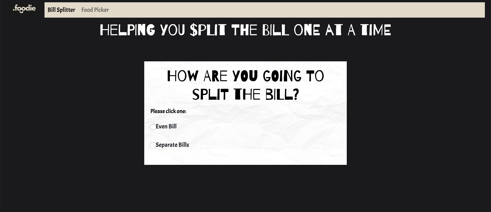

# Foodie
Foodie is a simple web app to be use in Puerto Rico. 2 - 1 app that helps you divide your bill into even or separate, not only that but it also has a random food picker. You choose what type of food you would like to eat and it will choose for you! Remember is only meant to be use in Puerto Rico. 

Deployment: https://lilliana1.github.io/foodie-app/



## Code 

```js
//calculate
let calculate = function () {
    let subTotal = document.getElementById("subTotal").getAttribute("data-subtotal")

    let tip = document.getElementById("selectedTip").value;
    let tipAmount = tip * subTotal;
    let bill = (subTotal * 1.07) + tipAmount;

    document.getElementById("tipAmount").innerText = "$" + Number(tipAmount).toFixed(2);
    document.getElementById("newTotal").innerText = "$" + Number(bill).toFixed(2);
}
``` 

## Technologies
* HTML
* CSS
* Bootstrap
* Animate.css
* Vanilla JS

## Instalation
1. On GitHub, navigate to the main page of the repository.
2. Under the repository name, click Clone or download.
3. To clone the repository, click "Clone with HTTPS".
4. Open Terminal.
5. Change the current working directory to the location where you want the cloned directory to be made.
6. Type git clone, and then paste the URL you copied in Step 2.
7. Press Enter. Your local clone will be created.

## Authors
* Lilliana Ramos

